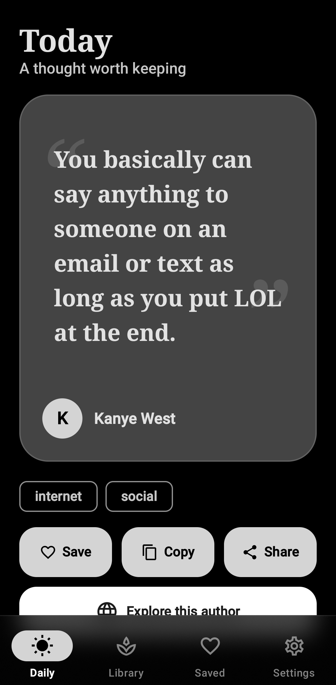
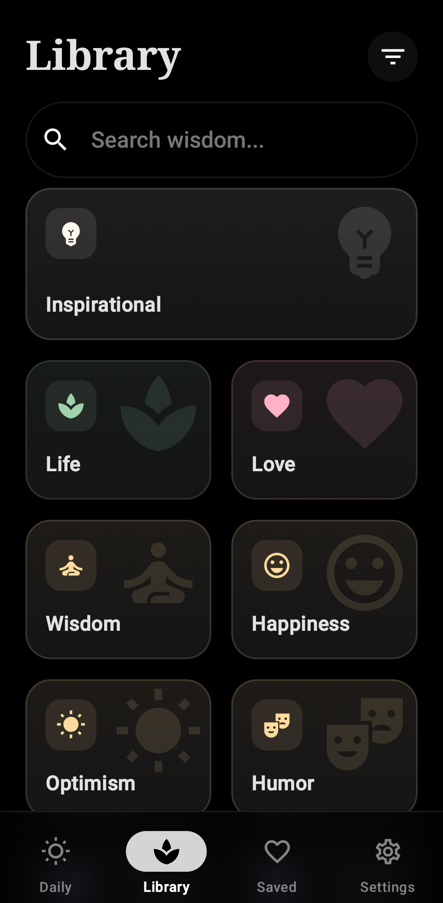
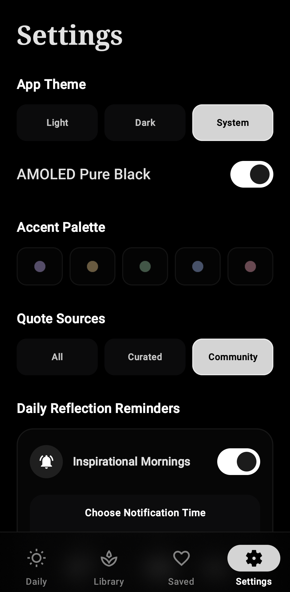
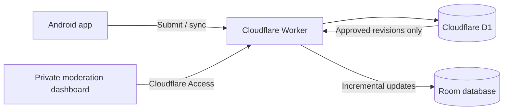

<div align="center">
  
  <h1>Quote</h1>
  <p><strong>An offline-first Android home for curated wisdom and moderated community quotes.</strong></p>

  <a href="https://github.com/Brokoli5191/Quote/releases/latest"></a>
  <a href="https://github.com/Brokoli5191/Quote/releases/latest"></a>
  <a href="app/src/main/java"></a>
  <a href="LICENSE"></a>
  <a href="https://github.com/Brokoli5191/Quote/releases"></a>

  <br>
  <a href="https://github.com/Brokoli5191/Quote/releases/latest"><strong>Download the latest APK</strong></a>
  &nbsp;&middot;&nbsp;
  <a href="https://quote.cowsay.win/privacy">Privacy & submission policy</a>
</div>

## A Thought Worth Keeping

Quote combines a fast local library with an optional, human-reviewed community collection. It works offline, keeps personal quotes on-device by default, and synchronizes only approved community submissions through a lightweight Cloudflare backend.

<div align="center">
  
  
  
</div>

## Highlights

### Daily and Library

- Stable daily quote selection with manual cycling and no-repeat history.
- Search across quote text, authors, and tags.
- Browse a visual catalog of topics including Life, Love, Wisdom, Happiness, Optimism, Humor, and more.
- Save, copy, share, and explore quote authors.
- Continue browsing without a connection through the local Room database.

### Curated and Community Sources

- Choose **All**, **Curated**, or **Community** in Settings.
- Apply the selected source consistently to Daily, Library, search, widgets, and reminders.
- Download approved community changes incrementally instead of replacing the whole database.
- Refresh at app startup and every 12 hours with Android WorkManager.
- Preserve favorites when a community quote is edited.

### Personal Quotes

- Write and keep custom quotes under **My Quotes**.
- Optionally submit a quote to the private moderation queue.
- See its live state as **Pending review**, **Approved for community**, or **Not approved**.
- Keep personal quotes local unless submission is explicitly confirmed.
- Export and restore personal quotes and favorites as JSON.

### Designed for Android

- Jetpack Compose interface with expressive motion and predictive back support.
- Light, dark, Material You, and true-black AMOLED presentation.
- Violet, amber, green, blue, and rose accent palettes.
- Low-performance mode for devices that benefit from reduced motion and effects.
- Configurable home-screen widget with colors, typography, scale, border, blur, and element positioning.
- Scheduled daily quote notifications.

## Community Moderation

Submissions never enter the public collection automatically.

1. The Android app sends a confirmed submission to the Cloudflare Worker.
2. Cloudflare D1 stores it in a private pending queue.
3. The moderation dashboard is protected by Cloudflare Access.
4. A moderator can edit, approve, reject, unpublish, or republish the quote.
5. Approved revisions synchronize to Android clients; unpublished records propagate as deletions.

The public API exposes approved community quotes only. Installation identifiers and IP addresses are salted and hashed before storage for rate limiting and abuse prevention.



## Install

Quote supports Android 7.0 and newer.

1. Open the [latest GitHub release](https://github.com/Brokoli5191/Quote/releases/latest).
2. Download `Quote-<version>.apk`.
3. Allow installation from your browser or file manager when Android asks.
4. Install the APK and open Quote.

The in-app update checker can notify you when a newer GitHub release is available.

## Build the Android App

Requirements:

- JDK 17 or newer
- Android SDK with API 36 installed
- Android Studio or the Gradle wrapper

Create `local.properties` in the repository root:

```properties
sdk.dir=C:/Users/YourName/AppData/Local/Android/Sdk
```

Build and test on Windows:

```powershell
.\gradlew.bat test assembleDebug
```

Build and test on macOS or Linux:

```sh
./gradlew test assembleDebug
```

The debug APK is written to `app/build/outputs/apk/debug/app-debug.apk`.

## Run the Backend

The backend lives in [`backend/`](backend/) and contains the Worker, D1 migrations, moderation dashboard, Access JWT verification, and tests.

```sh
cd backend
npm install
npm test
npm run check
npx wrangler dev
```

See [`backend/README.md`](backend/README.md) for D1 creation, migrations, secrets, Cloudflare Access, and deployment instructions.

## Project Structure

```text
app/                         Android application
  src/main/java/             Compose UI, Room, sync, widgets, notifications
  src/main/res/              Icons, themes, widget resources, bundled quotes
  src/test/                  JVM and Robolectric tests
backend/                     Cloudflare Worker and moderation service
  migrations/                D1 submission and community schemas
  src/                       API, Access verification, dashboard, policy
.github/screenshots/         README screenshots captured from the release app
```

## Technology

| Area | Technology |
| --- | --- |
| Android UI | Kotlin, Jetpack Compose, Material 3 |
| Local data | Room, SharedPreferences |
| Background work | AndroidX WorkManager |
| Backend | Cloudflare Workers, TypeScript |
| Online data | Cloudflare D1 |
| Admin security | Cloudflare Access with verified JWTs |
| Testing | JUnit, Robolectric, Roborazzi, Vitest |

## Privacy

Creating personal quotes does not upload them. Submission is optional and requires confirmation. Read the complete [Privacy & Submission Policy](https://quote.cowsay.win/privacy) for collected fields, moderation, retention, and Cloudflare processing.

## Contributing

Issues and focused pull requests are welcome. For changes involving Room or D1, include a migration and preserve existing user data. Run the Android and backend test suites before opening a pull request.

## License

Quote is available under the [MIT License](LICENSE).
